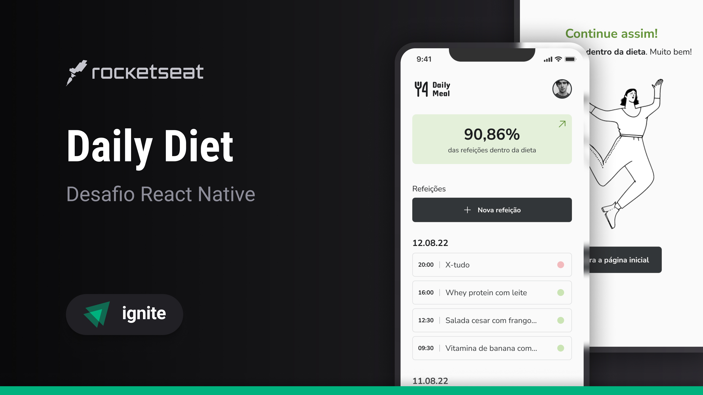

<h1 align="center"> Daily Diet </h1>

  Projeto desenvolvido como desafio para fortalecer meus conhecimentos em React Native c/ Expo, Styled Components e Typescript. Desafio da <a href="https://www.rocketseat.com.br/">Rocketseat</a>.

  <a href="#-tecnologias">Tecnologias</a>&nbsp;&nbsp;&nbsp;|&nbsp;&nbsp;&nbsp;
  <a href="#-projeto">Projeto</a>&nbsp;&nbsp;&nbsp;|&nbsp;&nbsp;&nbsp;
  <a href="#-layout">Layout</a>&nbsp;&nbsp;&nbsp;|&nbsp;&nbsp;&nbsp;
  <a href="#-contribuição">Contribuição</a>&nbsp;&nbsp;&nbsp;|&nbsp;&nbsp;&nbsp;
  <a href="#memo-licença">Licença</a>

  

 

  

## 🚀 Tecnologias

Esse projeto foi desenvolvido com as seguintes tecnologias:

- [React Native](https://reactnative.dev/) com [Expo](https://expo.dev/)
- [Node e NPM](https://nodejs.org/)
- [TypeScript](https://www.typescriptlang.org/)
- [Styled Components](https://styled-components.com/)
- [AsyncStorage](https://react-native-async-storage.github.io/async-storage/)

## 💻 Projeto

O Daily Diet é um app mobile para você ter o controle da sua dieta, registrando suas refeições e acompanhando seu progresso.

## 🔖 Layout

Você pode visualizar o layout do projeto através [DESSE LINK](https://www.figma.com/community/file/1218573349379609244/duplicate). É necessário ter conta no [Figma](https://figma.com) para acessá-lo.

## :memo: Licença

Esse projeto está sob a licença MIT.

---

Feito com ❤️ by Poveii
